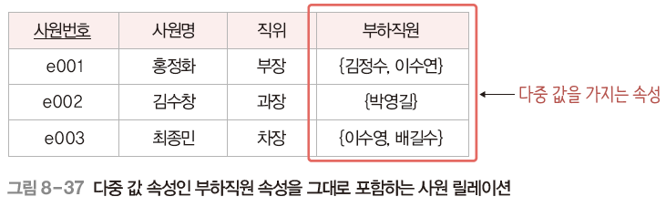
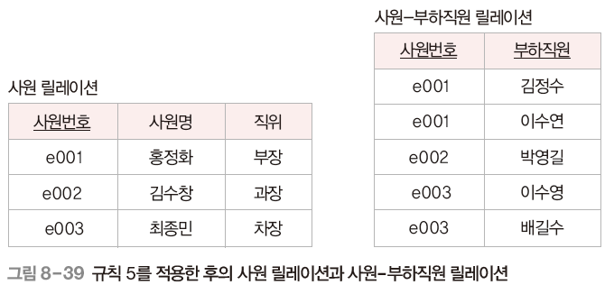

# 데이터베이스 설계

## 01 데이터베이스 설계 단계

1. 요구사항 분석 : DB의 용도 파악
2. 개념적 설계 : DBMS에 독립적인 개념적 구조 설계
3. 논리적 설계 : DBMS에 적합한 논리적 구조 설계
4. 물리적 설계 : DBMS로 구현가능한 물리적 구조 설계
5. 구현

## 03 개념적 설계

- DBMS에 독립적인 개념적 스키마 설계
- 일반적으로 E-R 모델 이용

1. 개체와 속성 추출
2. 관계 추출 
   - 매핑 카디널리티(1:1 / 1:n / n:m)와 참여 특성 결정
3. E-R 다이어그램 작성

## 04 논리적 설계

1. 모든 **개체**는 **릴레이션**으로

2. **n:m** 관계는 **릴레이션**으로

3. **1:n**은 **외래키**로, n의 릴레이션에 1의 기본키를 외래키로

4. **1:1**은 **외래키**로

   4-1. 외래키를 서로 주고받음 

   4-2. 필수적으로 참여하는 개체의 릴레이션만 외래키를 받음 

   4-3. 모든 개체가 필수적으로 참여하면 릴레이션을 하나로 합침 

5. **다중 값 속성**은 **릴레이션**으로

## 05 물리적 설계와 구현

- 물리적 설계 : 하드웨어나 운영체제의 특성을 고려해 필요한 인덱스 구조나 내부 저장 구조 등에 대한 물리적 구조를 설계
- 구현 : SQL로 작성한 명령문을 DBMS에서 실행하여 데이터베이스를 실제로 생성

