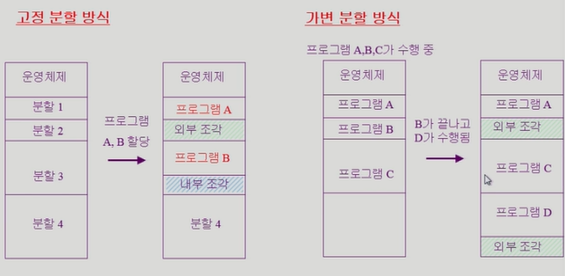

# 메모리 관리 - (1)

메모리 주소 종류, 주소 바인딩, 연속할당

- 프로그램이 실행되면 그 프로그램의 독자적인 자신만의 메모리 주소를 가지게됨 이걸 가상주소라함
- 가상주소와 물리적 주소 간 주소 변환 필요

## Logical Address VS Physical Address

#### Logical Address

- 각 프로세스마다 독립적으로 가지는 주소 공간
- 0번지부터 시작
- CPU가 보는 주소는 Logical Address임, 기계어로 변환되었을 때 기계어 내의 주소는 Logical Address임
- 사용자 프로그램은 logical address만을 다룸, physical address 못봄

#### Physical Address

- 메모리에 실제 올라가는 위치

>  메모리 주소 변환은 OS가 하는게 아님. 하드웨어가 하는거

## 주소 바인딩(Address Binding)

- 주소를 결정하는 것
- Symbolic Address -> Logical Address -> Physical Address
- 컴파일되면 Symbolic Address가 Logical Address로 변환되고, Logical이 Physical Address까지 변환됨

#### Compile Time Binding

- Physical address가 컴파일시 알려짐
- 절대코드(absolute code) 생성

#### Load TIme Binding

- Loader의 책임 하에 Physical address 부여
- 컴파일러가 재배치가능코드(relocatable code) 생성한 경우 가능

#### Run Time Binding

- 수행이 시작된 이후에도 메모리 상 위치 옮길수있음

## MMU (Memory Management Unit)

- 주소 변환 담당하는 HW
- Logical Address를 Physical Address로 매핑
- 생성되는 모든 주소값에 base register(relocation register)값을 더함

## Dynamic Loading

- 프로세스 전체를 메모리에 미리 다 올리는 것이 아니라 해당 루틴이 불려질때 메모리에 load 하는 것
- 가끔씩 사용되는 많은 양의 코드에 유용 ex) 오류 처리

## Overlays

- 메모리에 프로세스 중 필요한 부분만 올림
- 프로세스 크기> 메모리 크기 일때 유용

## Swapping

- 프로세스를 일시적으로 메모리에서 Backing Store로 쫓아내는것

- Backing Store : 디스크 -> 충분히 빠르고 큰 저장 공간

- Swap-In / Swap-Out : 중기 스케줄러에 의해 Swap Out 시킬 프로세스 선정

  

## Dynamic Linking

- Linking을 실행시간까지 미루는 기법
- Static : 라이브러리가 프로그램의 실행 파일코드에 포함됨, 실행 파일 크기 커짐
- Dynamic : 라이브러리가 실행시 연결됨, OS의 도움 필요

## 물리적 메모리 할당

- 낮은 영역에는 OS 상주, 나머지는 사용자 프로세스 영역
- Contiguous : 각각의 프로세스가 메모리의 연속적인 공간에 적재 (고정 분할, 가변 분할)
- NonContiguous : 하나의 프로세스가 여러 영역에 분산돼서 적재 (페이징, 세그멘테이션, Paged Segmentation)

#### 연속 할당

- 고정 분할 : 내부단편화, 외부 단편화
- 가변 분할 : 외부단편화 
- First-Fit : 빈공간중 첫번째로 발견되는곳, Best-Fit : 빈공간중 가장 작은곳, Worst-Fit : 빈공간중 가장 큰곳
- compaction : 사용중인 메모리 영역을 한군데로 몰고 hole들을 한곳으로 몰아 큰 block을 만듦. 비용이 많이 듦

